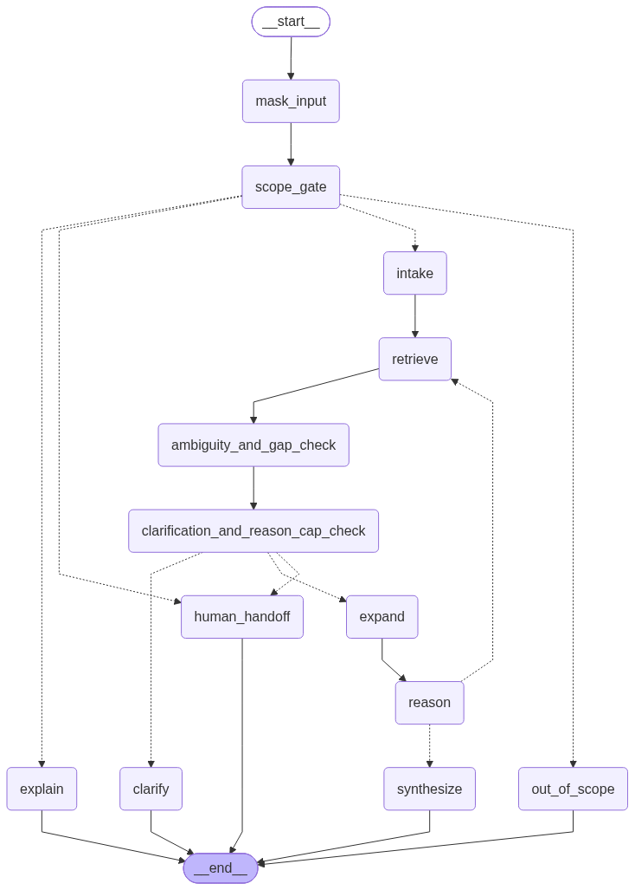

# FINRA Compliance Reasoning Agent

An AI agent that helps broker-dealers and other FINRA-regulated professionals figure out which FINRA clauses apply to their specific situation. Given a plain-language description of a scenario, it clarifies ambiguous or missing facts, retrieves the relevant clauses from a purpose-built knowledge base of ~1,300 FINRA clauses, reasons over them with explicit, auditable logic, and returns a structured answer — with the option to hand off to a human compliance officer when the situation warrants it. The system spans the full LLM engineering stack: a deterministic + LLM-hybrid data ingestion pipeline, a stateful multi-turn agent built on LangGraph, a custom evaluation harness with simulated users, and an MCP server for integration into other tools.

## Beyond a Standard RAG Pipeline

1. **Retrieval-guided clarification.** The agent doesn't ask clarifying questions off a static checklist. It retrieves candidate clauses first, based on the situation as understood so far, and only asks a follow-up question if a specific retrieved clause depends on a fact that hasn't been given yet. Every question is grounded in real, retrieved rule text — retrieval drives the conversation, not just the final answer.
2. **Explainable reasoning.** Every clause in the final answer is labeled with its role (governing rule, exception, condition, definition, etc.) and comes with a reasoning trace tying it to the user's specific facts, plus any conflicts and how they were resolved. The answer is auditable, not just generated — which matters for a compliance tool.
3. **A purpose-built, reverse-engineered evaluation dataset.** Rather than hand-writing test questions, every evaluation case is generated backward from the actual FINRA clause text — an LLM is given real clauses first and asked to construct a realistic situation for which those specific clauses are the correct and complete answer. This is a custom evaluation harness written from scratch for this use case, not a ready-made evaluation library — including the metrics, the LLM-as-judge scoring, and a **simulated user** that role-plays the person asking, holding back or revealing facts according to a difficulty tier. The full pipeline — multi-turn conversation, scoring across retrieval/reasoning/hallucination/quality/agentic-behavior, and reporting — is **fully automated**, with no manual grading step.

---

## Table of Contents
1. [Data Parsing and Ingestion](#data-parsing-and-ingestion)
2. [The Agentic Loop](#the-agentic-loop)
3. [Evaluation Harness](#evaluation-harness)
4. [MCP Server](#mcp-server)

---

## Data Parsing and Ingestion

Ingestion runs in four stages: **parse → normalize → embed → index**.

**Parsing.** FINRA rule HTML is cleaned (structural tags kept, everything else stripped before parsing to avoid spurious line breaks from BeautifulSoup) and then split into a nested clause hierarchy — `(a)`, `(a)(1)(A)`, `.01` supplementary-material markers, etc. This chunking is fully **deterministic**: a small parser tracks marker sequences (numeric, alpha, roman, dot-style) and infers each clause's `clause_ref` and `parent_clause` from the marker grammar itself, not an LLM.

**Merging fragments upward.** Many leaf clauses are sentence fragments or list items that don't stand alone (e.g. ending in `; and`, or under 20 words). Each such clause is deterministically merged with its ancestor chain until a self-complete node is found, producing a `merged_clause` field alongside the original `raw_text`. This keeps the original clause boundaries intact for precise retrieval while ensuring the *embedded* text carries enough context to be understood on its own.

**Normalization.** Each clause is passed to an LLM with a fixed schema of tags — who the obligation falls on (`obligated_actor`), what it's about (`regulated_subject`, `activity_type`), which firm types it applies to, and a handful of booleans/metadata (`involves_customer`, `has_financial_threshold`, `frequency`, etc.), all constrained to enumerated values rather than free text. Because a single model's output isn't fully deterministic across runs, **four different LLMs** (o3, Claude Opus 4.7, GPT-5, Gemini 2.5 Pro) tag every clause independently, and the final tag set is decided by **majority vote** across the four — reducing the risk of any one model's idiosyncrasy defining a clause's tags.

**Embedding.** Four embedding models (2 closed-source API, 2 open-source local) were benchmarked on retrieval quality (MAP, recall@k) against hand-labeled test situations. `voyage-law-2` and a local `Octen-Embedding-8B` model performed best and comparably; `voyage-law-2` was chosen for production since it's a fast hosted API rather than requiring local GPU inference. The merged, context-complete text is what gets embedded.

**Indexing.** Clauses are indexed in **Qdrant**, storing both a dense vector (from the merged/context-rich text) and a BM25 sparse vector (deliberately from the *original*, unmerged text — using merged text for sparse search would make sibling clauses with shared ancestors compete on near-duplicate lexical content). All normalized tags are stored as filterable, indexed payload fields, so retrieval can combine semantic or keyword search with structured filters (e.g. "clauses about supervision that involve a customer and apply to carrying firms"). Qdrant was chosen for native hybrid dense+sparse support, pre-filtering that doesn't hurt recall, and a low-friction path from ~1,300 clauses today to a much larger index later.

---

## The Agentic Loop

The core of this assistant is a stateful, multi-turn conversation, not a single-shot Q&A — figuring out which FINRA clause applies often takes several exchanges (clarifying questions, follow-up searches, occasional handoff to a human). **LangGraph** was chosen to model this as an explicit state machine: one shared state object flows through every step, persists across turns via a checkpointer, and can pause mid-conversation (e.g. to ask the user a question) and resume exactly where it left off.



### High-level flow

```
mask_pii → scope_gate ─┬─→ human-in-the-loop → END   (user asked for a human)
                        ├─→ out_of_scope → END        (off-topic message)
                        ├─→ explain → END              (question about the conversation itself)
                        └─→ intake → retrieve → clarification check ─┬─→ clarify → END
                                                                       ├─→ human-in-the-loop → END  (asked too many questions already)
                                                                       └─→ expand → reason ⇄ retrieve (loop until confident)
                                                                                       │
                                                                                       ▼
                                                                                 synthesize → END (or → human-in-the-loop, if reasoning ran too long)
```

### What each stage does, and why it exists

- **Mask PII** — strips PII (emails, phone numbers, SSNs, account numbers) out of the message before it ever reaches an LLM, and restores it only when showing an answer to the user or emailing a human agent. A basic input safeguard for a compliance tool.
- **Scope gate** — a fast check that runs before anything else: is this actually a FINRA compliance question, is the user asking for a human, or are they asking about something already discussed? Keeps off-topic chatter and meta-questions from ever entering the heavier reasoning pipeline.
- **Intake** — turns what the user said into structured facts (using the same vocabulary the clause database is tagged with), keeps a running plain-language summary of the whole situation, and tracks which fields the user has explicitly said they're unsure about — so the agent never re-asks something it's already been told "I don't know" to.
- **Retrieve** — always re-runs a fresh search against the *current* situation summary and known structured facts (as filters). Never cached across turns, because the summary itself updates every turn as new facts come in — so what's actually relevant can shift turn to turn.
- **Clarification / ambiguity check — the core differentiator.** Rather than checking for empty form fields, this step reads the actual clauses just retrieved and asks two distinct questions: (1) *Ambiguity* — could the user's underlying question itself mean more than one thing, each pointing at a different set of clauses? (2) *Gap* — do these specific retrieved clauses depend on a fact that isn't known yet (e.g. a clause requires a dollar threshold and none has been given; the clause outcome depends on retail vs. institutional customer, or on whether a third party is involved)? Only gaps that would actually change which clause applies trigger a question — nothing is asked just because a field happens to be empty.
- **Clarify** — asks the single most important open question (justified by the retrieval above) and waits for the user's reply.
- **Expand → Reason** — candidate clauses are merged into a working "clause graph," then handed to the reasoning step. The reasoner can pull additional context with its own tools (dense semantic search, exact BM25 keyword search, or direct clause/parent/child lookups) and, for every clause it judges relevant, assigns a role (is it the governing rule, an exception, a condition, a definition...) and writes a reasoning trace tying it to the user's specific facts. It flags any conflicts between clauses and how they're resolved, and — if it isn't yet confident the clause set is complete — loops back to retrieve instead of forcing an answer.
- **Synthesize** — once reasoning is confident, writes the final answer using only the clauses judged relevant, citing each by its exact clause reference, preserving the structure of roles (core obligation first, then exceptions/conditions/safe harbors), surfacing any unresolved conflicts plainly, and closing with any caveats the reasoning implies.
- **Human-in-the-loop** — a safety net reached three ways: the user directly asks for a person (a simple hand-off), or the system itself recognizes it's hit a limit — too many clarifying questions without resolving things, or too many reasoning cycles without reaching confidence — and hands the conversation to a compliance agent rather than guessing. Asks consent, collects contact details, and emails a summary to the compliance team.

### Safety caps

Two limits in `config/settings.py` keep the agent from getting stuck:

- **`MAX_CLARIFICATION_TURNS`** — the most clarifying questions the agent will ask in one conversation before handing off to a human instead of continuing to interrogate the user.
- **`MAX_REASONING_CYCLES`** — the most retrieve → reason loops allowed in a single turn. If hit, the agent still gives its best-effort answer, but also loops in a human, so a stuck reasoning loop degrades gracefully rather than failing silently or spinning indefinitely.

Together, these guarantee every conversation converges — to an answer, a clarifying question, or a human handoff — rather than looping indefinitely.

---

## Evaluation Harness

**The core differentiator of this evaluation is the data itself.** Instead of hand-written test questions, every eval case is *reverse-engineered from the actual FINRA clauses*: an LLM is given the real regulatory text first and asked to construct a realistic user situation for which those specific clauses are the correct and complete answer. This guarantees every test case is grounded in real rules rather than invented scenarios that only loosely map to them. On top of that, each case is tested at three difficulty levels that control how much of the situation the user discloses upfront — because in practice, users don't hide relevant details maliciously, they just don't know which facts are legally significant until asked.

**Evaluation data generation (Claude Sonnet 5).** Generation happens in two stages. First, situations and ground-truth cases are built for **12 distinct situation archetypes** — each targeting a different reasoning capability the agent needs, from the simple (a single self-contained clause) to the hard (conflicting clauses that must be flagged, cross-rule dependencies, entity-specific answers, questions with no applicable clause at all, genuinely ambiguous queries). Second, for every case, three query variants are generated:

- **Easy** — the query contains enough detail to retrieve the correct clause with no follow-up needed.
- **Medium** — the query states the general concern but naturally omits 1–2 facts the correct answer depends on.
- **Hard** — the query is vague and high-level, as a non-expert would actually ask it, omitting 3+ load-bearing details.

This difficulty ladder is the point: it evaluates not just whether the agent *knows* the rule, but whether it can recognize what it doesn't yet know and ask for it — a materially harder and more realistic test than single-shot retrieval accuracy alone.

**The 12 situations tested:** Single Clause Retrieval · Multiple Clauses (Same Role) · Multiple Clauses (Distinct Roles) · Hierarchical Dependency · Conditional Trigger · Rule with Safe Harbor · Conflicting Clauses · Cross-Rule Dependency · No Applicable Clause Within Scope · Numeric Threshold / Table Lookup · Ambiguous Query · Entity-Specific Clause.

**How the harness runs.** For each question, a simulated user (grounded strictly in the ground-truth situation, never inventing facts it wasn't given) converses with the agent until it produces a final answer, exhausts its clarification budget, or escalates to a human. The full conversation, retrieved clauses, and final answer are then scored across:

- **Retrieval** — recall against ground-truth clauses (deterministic)
- **Reasoning** — does the agent's reasoning match the expert rationale, does the final answer actually convey every required point (LLM-judged)
- **Hallucination** — are cited clauses real (deterministic, zero-tolerance), is the agent's reasoning about each clause faithful to its actual text (LLM-judged)
- **Answer quality** — responsiveness and structural clarity (LLM-judged, 1–5 scale)
- **Agentic behavior** — clarification turns, reasoning cycles, tool calls, handoff rate
- **Token usage** — per question and per underlying model, for cost tracking

**Avoiding self-bias.** The agent reasons using one model; the LLM-judge and the simulated user each run on a *different* model entirely. This is deliberate — grading a model's output with that same model risks it favoring its own reasoning style and phrasing over an honest, independent evaluation.

**Baseline.** A retrieval-only baseline (no agent, no reasoning, no judge) throws each query straight at the retriever under dense/sparse search and raw-query/expert-summary inputs. It isolates whether retrieval quality or query underspecification is the bottleneck, and gives the full agentic system a floor to actually beat — if the agent isn't outperforming naive retrieval on the same clauses, its added complexity isn't justified.

Every run produces a per-question JSONL log and a rolled-up JSON summary (per-situation and overall), so results can be audited at both the individual-question and aggregate level.

---

## MCP Server

In addition to the LangGraph-based chat agent (`agent/graph.py`), this project exposes its FINRA clause knowledge base and reasoning pipeline as an [MCP](https://modelcontextprotocol.io) server, so any MCP-compatible client (Claude Desktop, an IDE assistant, another agent) can query it directly.

### What it offers

**Tools** — actions the client can invoke:

| Tool | What it does |
|---|---|
| `search_clauses` | Semantic (dense) or keyword (sparse/BM25) search over the FINRA clause knowledge base, with optional metadata filters (`rule_id`, `obligated_actor`, `involves_customer`, `activity_type`). |
| `get_clause_children` | Fetch the sub-clauses nested under a given clause, one level deep or all descendants. |
| `get_clause_parent` | Fetch the clause(s) a given clause sits under, one level up or the full ancestor chain. |
| `resolve_cross_references` | Resolve every citation inside a clause's text — both bare rule-number citations (e.g. "2111, Suitability") and fully qualified inline clause citations — into the actual clause/rule records they point to. |
| `list_rules` | List every FINRA rule's metadata (id, name, category, source URL), optionally filtered by category. Useful for browsing when you don't yet know a specific rule or clause. |
| `ask_finra_compliance_agent` | Run a full turn of the compliance reasoning agent on a described situation — the same pipeline as the chat interface (clarification questions, iterative clause retrieval + reasoning, synthesis, and optional human handoff). Multi-turn: pass the returned `thread_id` back in on follow-up calls to continue the same conversation. Note: unlike the other tools, this one is not read-only — a conversation that reaches human handoff and receives consent will send a real email to the compliance team. |

**Resources** — exact-key lookups the client can read directly, without a search:

| Resource | What it returns |
|---|---|
| `finra-clause://{clause_ref}` | The full record for one clause — text, rule metadata, and structured fields. |
| `finra-rule://{rule_id}` | An entire rule — metadata plus every clause under it. |

Only the retrieval tools go through the vector database; `list_rules` and both resources read directly from the underlying data files, so they work even if Qdrant isn't running.

---

## Conclusion

This project was built end-to-end — from scraping and deterministically parsing raw FINRA rule HTML, through LLM-based clause normalization and hybrid dense/sparse retrieval, to a stateful LangGraph reasoning agent, a custom-built automated evaluation harness with simulated users, and an MCP server for third-party integration. It's meant as a working example of applied LLM/AI engineering on a real, high-stakes domain: retrieval, agentic reasoning, evaluation, and deployment, all in one system.
